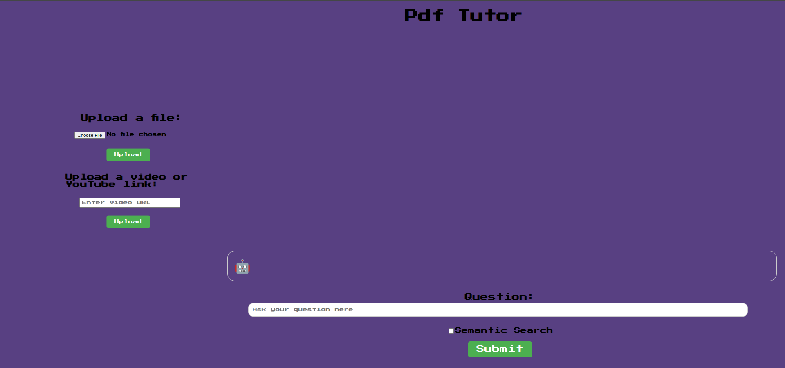

<p align="center"><h1 align="center">DOCUMENTREADER</h1></p>
<p align="center">
	
	
	
	
</p>
<p align="center"><!-- default option, no dependency badges. -->
</p>
<p align="center">
	<!-- default option, no dependency badges. -->
</p>
<br>
<p align="center">
    
</p>
<br>

##  Table of Contents

- [ Overview](#-overview)
- [ Features](#-features)
- [ Project Structure](#-project-structure)
  - [ Project Index](#-project-index)
- [ Getting Started](#-getting-started)
  - [ Installation](#-installation)
- [ Contributing](#-contributing)


##  Overview

<p>
  This is an intelligent question-answering assistant designed specifically for students. It enables users to upload documents (such as lecture notes, textbooks, or PDFs) and ask questions based on the content.

Powered by a combination of document ingestion and advanced language modeling, the chatbot retrieves relevant sections from the uploaded material and generates accurate, contextual responses. This makes it especially useful for:

📚 Understanding lengthy or complex study materials

🧠 Quickly reviewing key concepts before exams

🔍 Extracting specific information without reading the entire document

Whether you're preparing for a test or just revising, this RAG chatbot helps you learn more efficiently by turning static documents into interactive learning companions.
</p>

##  Features

<ul>
  <li>📄 <strong>Document Ingestion</strong><br>
    Accepts documents (PDF, DOCX, or plain text) uploaded by users and parses their content for further processing.
  </li>

  <li>🧠 <strong>Retrieval-Augmented Generation (RAG)</strong><br>
    Combines document retrieval with language generation to provide context-aware answers based on user-uploaded content.
  </li>

  <li>💬 <strong>Natural Language Question Answering</strong><br>
    Users can ask questions in plain language, and the bot returns intelligent responses grounded in the document content.
  </li>

  <li>⚡ <strong>Fast and Lightweight</strong><br>
    Built with performance in mind, offering quick responses with minimal latency using efficient retrieval pipelines.
  </li>

  <li>📂 <strong>Multi-Document Support</strong><br>
    Capable of handling multiple documents at once, making it suitable for cross-referencing different study resources.
  </li>

  <li>🔧 <strong>Customizable Pipeline</strong><br>
    Modular design allows developers to plug in different embedding models, vector stores, or LLMs as needed.
  </li>
</ul>

##  Project Structure

```sh
└── DocumentReader.git/
    ├── Dockerfile
    ├── LICENSE
    ├── README.md
    ├── backend
    │   ├── .env
    │   ├── config.yml
    │   ├── data
    │   ├── ingest.py
    │   ├── llm
    │   ├── main.py
    │   ├── requirements.txt
    │   └── vectorstore
    ├── frontend
    │   ├── .gitignore
    │   ├── package-lock.json
    │   ├── package.json
    │   ├── public
    │   ├── src
    │   └── tsconfig.json
    └── images
        └── home.png
```

##  Getting Started

###  Installation

Install DocumentReader.git using one of the following methods:

**Build from source:**

1. Clone the DocumentReader.git repository:
```sh
❯ git clone https://github.com/Arush04/DocumentReader.git
```

2. Navigate to the project directory:
```sh
❯ cd DocumentReader.git
```

3. Install the project dependencies:


**Using `pip`** &nbsp; [](https://pypi.org/project/pip/)

```sh
❯ pip install -r backend/requirements.txt
```


**Using `npm`** &nbsp; []()

```sh
❯ npm install
```

##  Contributing

- **💬 [Join the Discussions](https://github.com/Arush04/DocumentReader.git/discussions)**: Share your insights, provide feedback, or ask questions.
- **🐛 [Report Issues](https://github.com/Arush04/DocumentReader.git/issues)**: Submit bugs found or log feature requests for the `DocumentReader.git` project.
- **💡 [Submit Pull Requests](https://github.com/Arush04/DocumentReader.git/blob/main/CONTRIBUTING.md)**: Review open PRs, and submit your own PRs.
